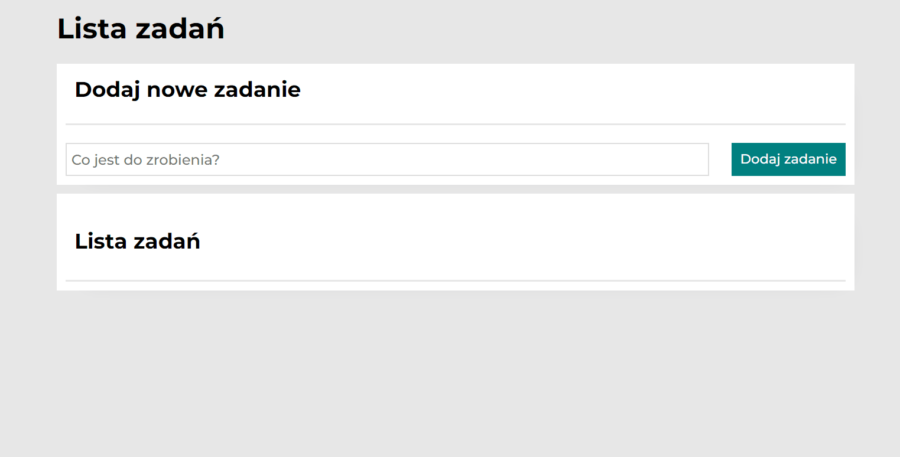

# Tasks lists

## My first tasks list which is based on YouCode course.
You can add new tasks, mark them as done and then remove.

### Technologies used:
HTML,
Java Script,
CSS (BEM, GRID)

### Check demo: https://github.com/Anna-Malik/tasks-list.git

